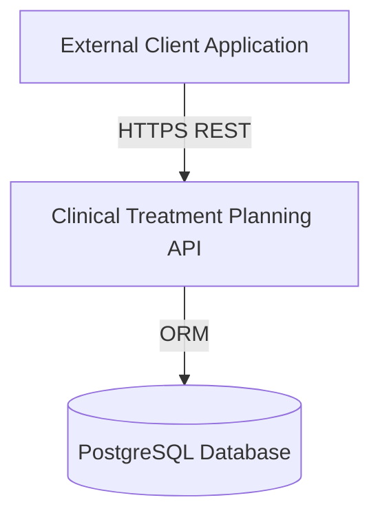
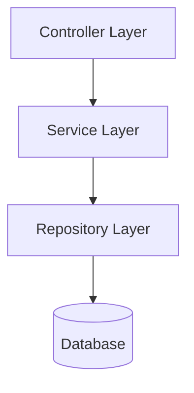
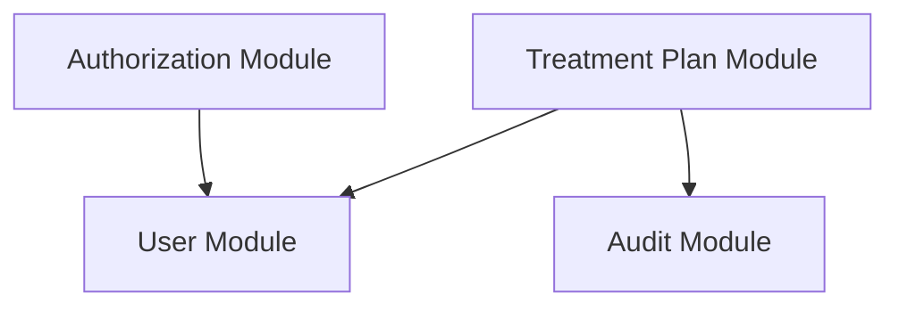
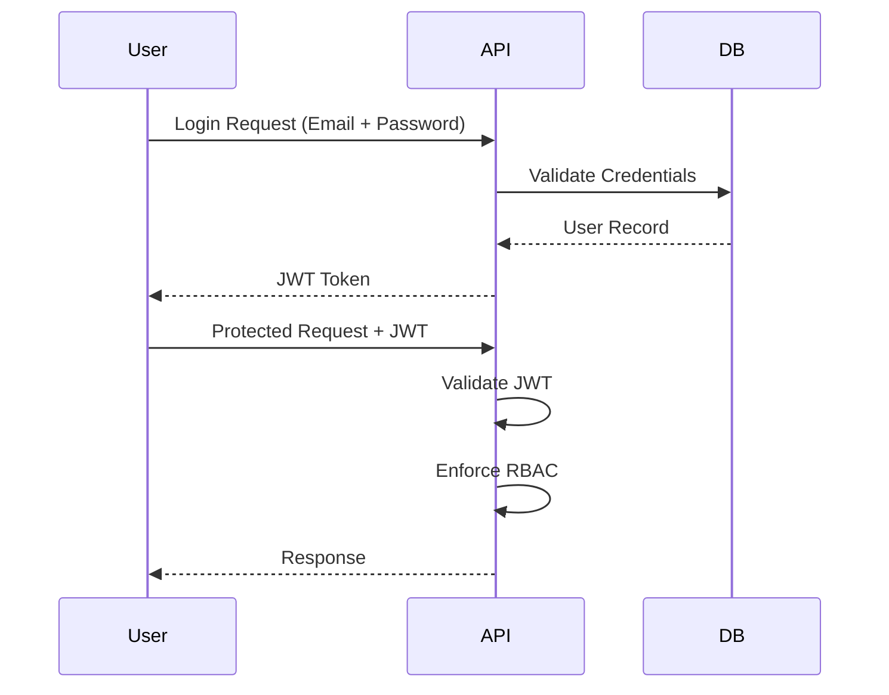
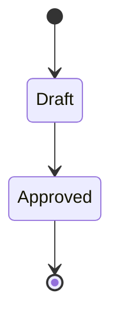
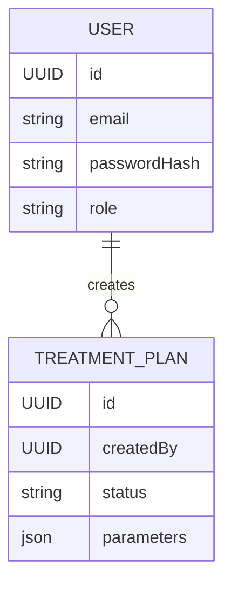

# Clinical Treatment Planning API: System Architecture

Version: 0.1  
Status: First Draft  
Author: Yashesh Dasari  
Date: February 25, 2026  

Find the revision details at the end of the document.

---

# 1. Architectural Overview
The Clinical Treatment Planning API is a backend-only REST API implemented using NestJS architecture. The system is structured 
according to layered design principles and aligned with selected principles outlined in [International Electrotechnical Commission 62304](https://webstore.iec.ch/en/publication/22794) (IEC 62304): Medical device software - Software life cycle processes. 
The system does not interface with medical hardware and is purposed for workflow and configuration management.

---

# 2. System Context Design
The system acts as the system boundary and external systems interact only through secured REST endpoints. 
The following System Context Diagram illustrates the Clinical Treatment Planning API as the system boundary and 
its interactions with external clients and the PostgreSQL database.

---

# 3. System Architecture
The system follows a layered architecture model, as illustrated by the Logical Layered Architecture Diagram below.

### 3.1 Controller Layer
The Controller Layer is responsible for the following tasks:
1. Handling HTTP requests
1. Input validation
1. Response formatting
1. Delegating logic to services

### 3.2 Service Layer
The Service Layer is responsible for the following tasks:
1. Business logic
1. Status transition enforcement
1. Authorization decisions
1. Lifecycle validation

### 3.3 Repository Layer
The Repository Layer is responsible for the following tasks:
1. Data persistence
1. Database queries
1. ORM interaction

---

# 4. Module Decomposition
The system is divided into the following core modules:
1. Authentication Module
2. User Module
3. Treatment Plan Module
4. Audit Module

The following Module Decomposition Diagram illustrates the logical separation of concerns and directional dependencies between system modules.

# 5. Authentication and Authorization Architecture
The following Sequence Diagram illustrates the runtime interaction between a user and the system during authentication and subsequent access to protected endpoints. 
The diagram depicts the following:
1. Credential validation flow
2. JWT issuance process
3. Token validation 
4. Role-Based Access Control enforcement

### 5.1 Architectural intent to satisfy Software Requirements
1. Password hashing and validation occur within the Auth module, satisfying SEC-1.
2. JWT issuance satisfies FR-2.
3. RBAC enforcement satisfies FR-3 and SEC-3.
4. All protected endpoints require valid JWT authentication, satisfying SEC-2.

Authentication and authorization logic is enforced prior to business logic execution to ensure controlled access to system resources.

---

# 6. Treatment Plan Lifecycle Architecture
The system allows two Treatment Plan states as listed below:
1. Draft
2. Approved

The following State Diagram illustrates the lifecycle states of a Treatment Plan and the 
valid transitions between those states.

### 6.1 Architectural intent to satisfy Software Requirements
1. Treatment Plans are initially created in the Draft state, satisfying FR-4.
2. Only Admin users may transition a plan from Draft to Approved, satisfying FR-7.
3. No reverse transitions are permitted, satisfying FR-8.
4. Approved plans cannot be modified, satisfying FR-6.

State transition validation is enforced within the Service layer to ensure business rule integrity.

---

# 7. Data Model
The following Entity-Relationship Diagram (ERD) illustrates the logical data structure and relationships between 
primary entities within the system.

### 7.1 Architectural intent to satisfy Software Requirements
The data model supports FR-4 through FR-9 and SEC-1 through SEC-4 as described below.
1. Each Treatment Plan is associated with exactly one User (creator), supporting FR-4, FR-5, and FR-7.
1. Role attributes determine authorization scope, supporting FR-3 and SEC-3.
1. Status field supports lifecycle enforcement, supporting FR-6, FR-7, and FR-8.
1. Parameters field supports structured configuration storage, supporting FR-4, FR-9, and SEC-4.
1. Password hash storage within USER entity, supporting SEC-1.

---

# 8. Security Architecture
Security controls are implemented at the following layers:
1. Input validation at Controller layer
1. JWT validation middleware
1. RBAC enforcement in Guards
1. Status transition validation in Service layer
1. Password hashing before persistence

No public endpoint bypasses authentication except login.

---

# 9. Requirement Traceability Mapping
| Module                | Related Requirements     |
|-----------------------| ------------------------ |
| Authorization Module  | FR-1, FR-2, SEC-1, SEC-2 |
| User Module           | FR-3                     |
| Treatment Plan Module | FR-4 to FR-9             |
| Security Layer        | SEC-2, SEC-3, SEC-4      |
| Architecture          | NFR-1, NFR-2, NFR-5      |

---

# 10. Architectural Constraints
1. Backend-only implementation.
2. Docker-based local deployment.
3. PostgreSQL as primary database.
4. No real patient data.
5. Aligns with selected IEC 62304 principles, but not formally certified under IEC 62304.

---