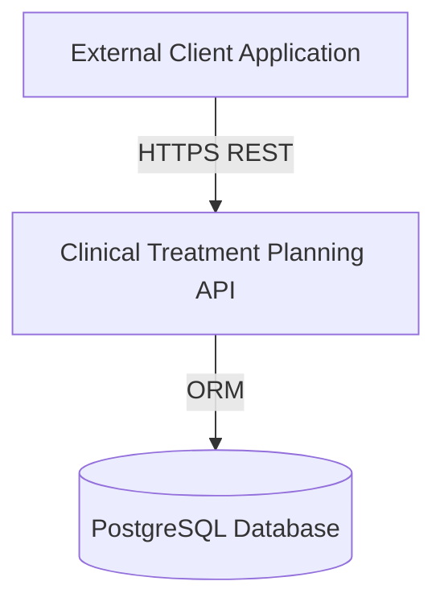
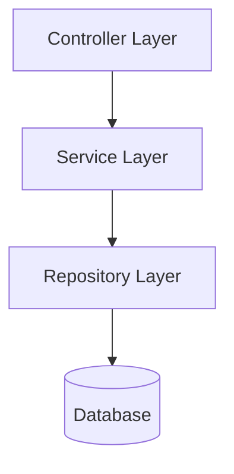

# Clinical Treatment Planning API: System Architecture

Version: 0.1  
Status: First Draft  
Author: Yashesh Dasari  
Date: February 25, 2026  

Find the revision details at the end of the document.

---

# 1. Architectural Overview
The Clinical Treatment Planning API is a backend-only REST API implemented using NestJS architecture. The system is structured 
according to layered design principles and aligned with selected principles outlined in [International Electrotechnical Commission 62304](https://webstore.iec.ch/en/publication/22794) (IEC 62304): Medical device software - Software life cycle processes. 
The system does not interface with medical hardware and is purposed for workflow and configuration management.

# 2. System Context Design
The system acts as the system boundary and external systems interact only through secured REST endpoints. 
The following System Context Diagram illustrates the Clinical Treatment Planning API as the system boundary and 
its interactions with external clients and the PostgreSQL database.

# 3. System Architecture
The system follows a layered architecture model, as illustrated by the Logical Layered Architecture Diagram below.

### 3.1 Controller Layer
The Controller Layer is responsible for the following tasks:
1. Handling HTTP requests
1. Input validation
1. Response formatting
1. Delegating logic to services

### 3.2 Service Layer
The Service Layer is responsible for the following tasks:
1. Business logic
1. Status transition enforcement
1. Authorization decisions
1. Lifecycle validation

### 3.3 Repository Layer
The Repository Layer is responsible for the following tasks:
1. Data persistence
1. Database queries
1. ORM interaction